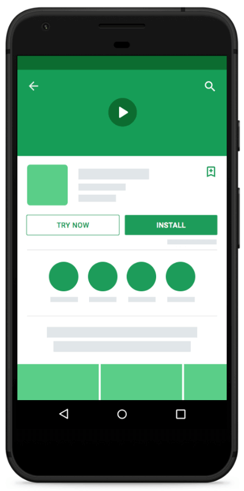
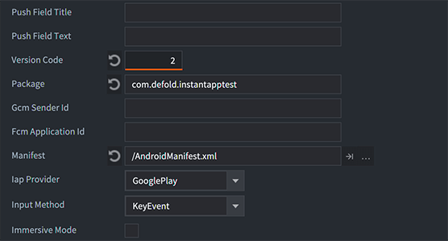
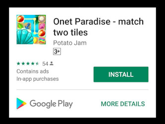
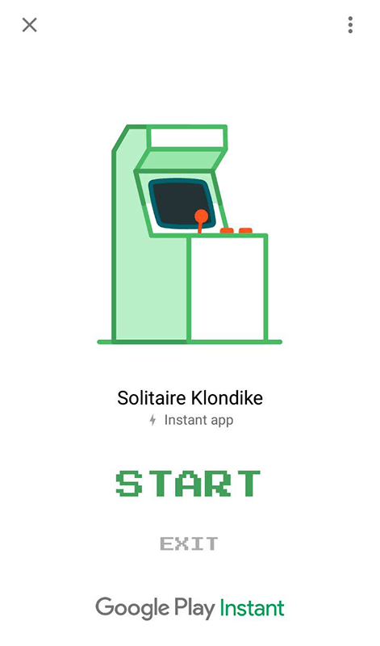

# Google Play Instant

Google Play Instant enables native games to launch on devices running Android 6.0+ without being installed.



## Publishing process

To be able to publish your game as Google Play Instant app you need to set up your project properly:

1. Create custom `AndroidManifest.xml` file and add the following attributes to the `<manifest>` element:

```lua
xmlns:dist="http://schemas.android.com/apk/distribution"
android:targetSandboxVersion="2"
```
The following declaration need to be added right after manifest element:
```lua
<dist:module dist:instant="true" />
```

This is what it would look like with the default AndroidManifest.xml:

```lua
<manifest xmlns:android="http://schemas.android.com/apk/res/android"
        package="{{android.package}}"
        android:versionCode="{{android.version_code}}"
        android:versionName="{{project.version}}"
        android:installLocation="auto"
        xmlns:dist="http://schemas.android.com/apk/distribution"
        android:targetSandboxVersion="2">
      <dist:module dist:instant="true" />
```

2. Add a dependency to the Google Instant Apps extension in your **game.project** file. Add “https://github.com/defold/extension-googleplayinstant/archive/master.zip” or point to the ZIP file of a [specific release](https://github.com/defold/extension-googleplayinstant/releases) to the Dependencies property.


3. Download libraries: Project->Fetch Libraries
4. Bundle `aab` Project->Bundle->Android Application
5. Upload your `aab` in Google Play Console as Android Instant App


### Version codes
Pay attention to [the recommendations about the version codes](https://developer.android.com/topic/google-play-instant/getting-started/game-instant-app#version-codes): Instant Game version code needs to be less than the version code of the installable game.




### android:targetSandboxVersion="2"

If you set `android:targetSandboxVersion="2"` in the main installable game you will be able to access the same files as instant game (a save file for example). But then you would have restrictions in the main application. More information in [the official documentation](https://developer.android.com/guide/topics/manifest/manifest-element#targetSandboxVersion).

::: sidenote
Once an app is installed, you can only update its target sandbox value to a higher value. To downgrade the target sandbox value, you must uninstall the app and replace it with a version whose manifest contains a lower value for this attribute.
:::

Even if you set different `android:targetSandboxVersion` in the installable game and instant game you are still able to use `instantapp.set_cookie()` and `instantapp.get_cookie()` for communication between the game versions.


## API Usage

The Google Play Instant extension is accessible through the `instantapp.*` namespace where it wraps Java [PackageManagerCompat methods](https://developers.google.com/android/reference/com/google/android/gms/instantapps/PackageManagerCompat) in a Lua API.

If you are working on a cross-platform application the best practice is to check the existence of `instantapp` module since this module exists only in android bundle:

```lua
if instantapp then
  -- call instantapp methods
end
```

For example:

```lua
if instantapp and instantapp.is_instant_app() then
  -- if this is instant app save data for the main app and show install prompt
  local cookie_size = instantapp.get_cookie_max_size()
  if cookie_size > 0 then
    instantapp.set_cookie(bytes_of_save_data)
  end
  instantapp.show_install_prompt()
else
  -- regular app logic
end
```


## API

If you are working on cross-platform application the best practice to check the existence of `instantapp` module, this module exists only in android bundle:
```lua
if instantapp then
  -- call instantapp methods
end
```

#### `instantapp.is_instant_app()` [Original DOC](https://developers.google.com/android/reference/com/google/android/gms/instantapps/PackageManagerCompat#isInstantApp%28%29)
Returns true if this application is an instant app.

```lua
if instantapp.is_instant_app() then
  --do something specific for instant app
end
```

#### `instantapp.show_install_prompt()` [Original DOC](https://developers.google.com/android/reference/com/google/android/gms/instantapps/InstantApps#showInstallPrompt(android.app.Activity,%20android.content.Intent,%20int,%20java.lang.String))
Shows a dialog that allows the user to install the current instant app.

```lua
if instantapp.is_instant_app() then
  instantapp.show_install_prompt() -- if this is instant app then show install prompt
else
  -- regular app logic
end
```

Popup example:



#### `instantapp.get_cookie_max_size()` [Original DOC](https://developers.google.com/android/reference/com/google/android/gms/instantapps/PackageManagerCompat.html#getInstantAppCookieMaxSize%28%29)
Gets the maximum size in bytes of the cookie data an instant app can store on the device.
```lua
local cookie_size = instantapp.get_cookie_max_size() --number, for example 16384
```

#### `instantapp.get_cookie()` [Original DOC](https://developers.google.com/android/reference/com/google/android/gms/instantapps/PackageManagerCompat.html#getInstantAppCookie%28%29)
Gets the instant application cookie for this app. Non instant apps and apps that were instant but were upgraded to normal apps can still access this API.

```lua
local cookie_byte_array = instantapp.get_cookie()
```

#### `instantapp.set_cookie()` [Original DOC](https://developers.google.com/android/reference/com/google/android/gms/instantapps/PackageManagerCompat.html#setInstantAppCookie%28byte%5B%5D%29)
Sets the instant application cookie for the calling app. Non instant apps and apps that were instant but were upgraded to normal apps can still access this API.

```lua
instantapp.set_cookie(bytes)
```


## Technical Requirements
According to the [Google Play Instant Technical Requirements](https://developer.android.com/topic/google-play-instant/game-tech-requirements) `apk` size must be less than or equal to 15 MB. Information about application size optimisation available [here](https://www.defold.com/extension-fbinstant/#reducing-bundle-size).


## Testing


1. Download Android SDK tools:
- macOS: https://dl.google.com/android/repository/tools_r25.2.3-macosx.zip
- Windows: https://dl.google.com/android/repository/tools_r25.2.3-windows.zip
- Linux: https://dl.google.com/android/repository/tools_r25.2.3-linux.zip
2. Unpack and copy the `tools` folder into `android-sdk` folder.
3. Install build tools:

```console
./android-sdk/tools/bin/sdkmanager --verbose “build-tools;25.0.3”
```
4. Install `extra-google-instantapps` tools:

```console
sh ./android-sdk/tools/android update sdk --no-ui --all --filter extra-google-instantapps
```

5. Launch `apk` as Instant game on your device:

```console
android-sdk/extras/google/instantapps/ia run path_to_your_game.apk
```

It's also possible to use this script for preparation instead of p.1-p.4:

```console
mkdir ~/android
cd ~/android
mkdir android-sdk
# Supported: macosx,linux,windows
PLATFORM=macosx
TOOL_VERSION=25.2.3
wget https://dl.google.com/android/repository/tools_r$TOOL_VERSION-$PLATFORM.zip
tar xvf tools_r$TOOL_VERSION-$PLATFORM.zip
mv tools android-sdk/tools
./android-sdk/tools/bin/sdkmanager --verbose "build-tools;25.0.3"
sh ./android-sdk/tools/android update sdk --no-ui --all --filter extra-google-instantapps
```

More information about debugging on mobile devices available in the [Debugging manual](https://www.defold.com/manuals/debugging/#_debugging_on_mobile_devices).


## Source code

The source code is available on [GitHub](https://github.com/defold/extension-googleplayinstant)


## API reference
